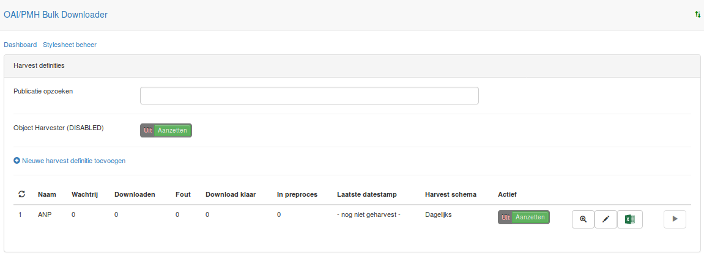
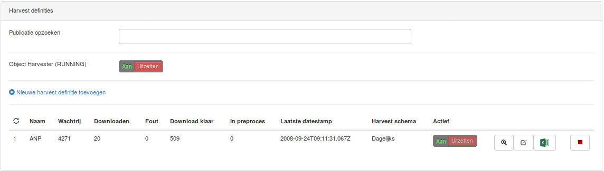
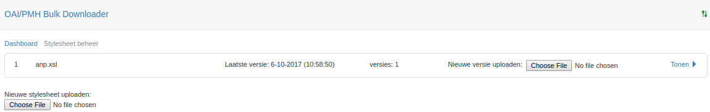
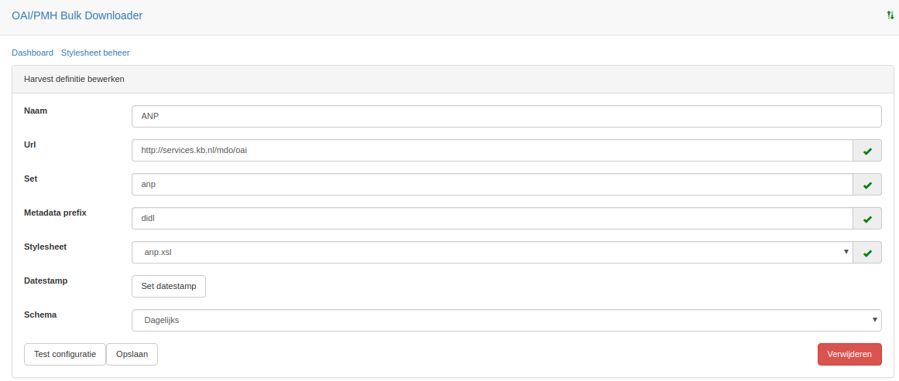
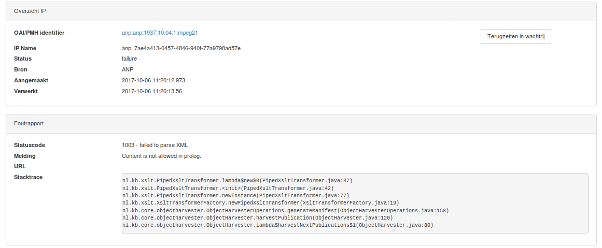
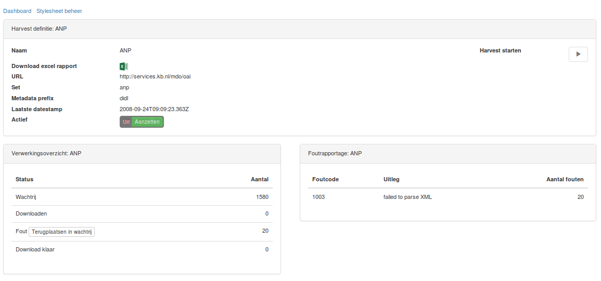

# Sample installation and basic use

## Table of Contents
- [Prerequisites](#prerequisites)
- [The install command](#the-install-command)
- [What is installed](#what-is-installed)
- [Overview of the preconfigured Dashboard](#overview-of-the-preconfigured-dashboard)
  * [The status overview](#the-status-overview)
- [Operating the harvester using the dashboard](#operating-the-harvester-using-the-dashboard)
- [Exploring the output](#exploring-the-output)
  * [manifest.initial.xml](#manifestinitialxml)
  * [procesdata.xml](#procesdataxml)
  * [procesdata.xml.sha512.checksum](#procesdataxmlsha512checksum)
  * [metadata.xml](#metadataxml)
  * [resources](#resources)
- [What did the oai-pmh-bulk-downloaded actually do?](#what-did-the-oai-pmh-bulk-downloaded-actually-do)
- [How did the install script actually configure the ANP repository?](#how-did-the-install-script-actually-configure-the-anp-repository)
  * [Uploading a stylesheet using the dashboard](#uploading-a-stylesheet-using-the-dashboard)
  * [Configuring a repository using the dashboard](#configuring-a-repository-using-the-dashboard)
    + [What is validated?](#what-is-validated)
- [What will happen when harvesting fails?](#what-will-happen-when-harvesting-fails)
  * [How can I mess up the harvester to see what happens?](#how-can-i-mess-up-the-harvester-to-see-what-happens)
- [Cleaning up](#cleaning-up)

## Prerequisites

For the sample installer to work the following two depencies must be met:
- A version Java 8 needs to be [installed and configured](http://tipsonubuntu.com/2016/07/31/install-oracle-java-8-9-ubuntu-16-04-linux-mint-18/)
- The ```curl``` tool must be present: ```sudo apt-get install curl``` 

## The install command

```bash
  mkdir oai-pmh-bulk-downloader
  cd oai-pmh-bulk-downloader
  wget --no-cache https://raw.githubusercontent.com/KBNLresearch/oai-pmh-bulk-downloader/master/sample/install-sample.sh -O - | sh
```


## What is installed

A quick look at the file [install-sample.sh](https://github.com/KBNLresearch/oai-pmh-bulk-downloader/blob/master/sample/install-sample.sh) 
will give a good first indication of the type of installation detailed in this section.

Steps of the installer
1) Downloads
- The latest stable build is downloaded (oai-pmh-bulk-downloader-latest.jar)
- A sample configuration is downloaded (example.yaml)
- A sample stylesheet is downloaded (anp.xsl)
- A sample OAI/PMH repository configuration is downloaded (anp.json)
2) Output directories
- A directory for succesful downloads is created: (output/in)
- A directory for rejected downloads is created: (output/rejected)
- A directory for processing is created: (output/processing)
3) The server is booted up in the background
- The install script will now wait for 10 seconds for the server to be properly booted
4) The database schema is loaded (using a REST call)
- The sample uses an in memory database [h2](http://www.h2database.com/html/main.html)
- When the server stops, all data is lost
- For a productive environment a mysql setup is advised
5) The anp.xsl stylesheet is uploaded (using a REST call)
6) The anp.json repository configuration is uploaded (using a REST call)

If all steps were performed succesfully you can now navigate to the following web 
address: [http://localhost:18080](http://localhost:18080)

The dashboard should look like this:


## Overview of the preconfigured Dashboard

The dashboard is still in Dutch, but the most basic operations are exposed using 
icons.

The top links point to this dashboard (Dashboard) and stylesheet management 
(Stylesheet beheer).

The block below contains (titled 'Harvest definities') contains the following things:
1) A quicksearch in the records loaded from the OAI/PMH endpoint (Publicatie opzoeken)
2) A toggle to turn the downloader for web resources on/off (Object Harvester)
- The object harvester is disabled by default
3) A link to create a new repository configuration (Nieuwe harvest definitie toevoegen)
4) A status overview of all the configured repositories

### The status overview

The status overview contains the following columns:
1) ID (of the configuration)
2) Amount of pending records (Wachtrij)
3) Amount of records in processing (Downloaden)
4) Amount of records which failed to download a web resource (Fout)
5) Amount of records which succeeded to download all web resources (Download klaar)
6) Reserved column for statuses the harvester does not know (In preproces)
7) The last OAI/PMH datestamp encountered by the harvester (Laatste datestamp)
8) Harvesting schedule (Harvest schema)
9) A toggle which activates this repository
10) A number of buttons with icons:
- Detail view of this repository's configuration and status (the magnifying glass)
- Edit this repository's configuration (the pencil)
- Download failures report as excel (the excel icon)
11) The start button
- This button starts a new harvest of the repository using ListIdentifiers
- This harvest only loads the pending column (Wachtrij)

## Operating the harvester using the dashboard

The following steps will turn on both the OAI/PMH harvester and the 'Object harvester'
for the loaded configuration:

1) Press 'Aanzetten' under 'Actief' to enable harvesting for this repository
2) Press the play button to the right to start harvesting identifiers
3) Press 'Aanzetten' next to 'Object Harvester (DISABLED)' to start downloading 
web resources
4) Wait a while, the OAI/PMH server can be slow to respond initially

The dashboard should now look something like this:



Before exploring the output it might be wise to stop the harvester again, especially
when there is not much space on your filesystem:
1) Press 'Uitzetten' next to 'Object Harvester (RUNNING)'
2) Press the stop button to the right
3) Press 'Uitzetten' under 'Actief'

## Exploring the output

In a terminal, from the ```oai-pmh-bulk-downloader``` directory you created, 
navigate to the directory ```output/in/anp```, and list the directories.

```bash
 cd output/in/anp
 ls 
```

The navigate into any of these directories (representing a single record from the
ANP set) and list the contents of this directory recursively 

```bash
  cd anp_[this_part_you_must_type_or_copy_paste]
  ls -lR
```

The output should look similar to this

```bash
.:
total 20
-rw-rw-r-- 1 rar010 rar010  838 Oct  6 09:51 manifest.initial.xml
-rw-rw-r-- 1 rar010 rar010 3298 Oct  6 09:51 metadata.xml
-rw-rw-r-- 1 rar010 rar010 1866 Oct  6 09:51 procesdata.xml
-rw-rw-r-- 1 rar010 rar010  128 Oct  6 09:51 procesdata.xml.sha512.checksum
drwxrwxr-x 2 rar010 rar010 4096 Oct  6 09:51 resources

./resources:
total 420
-rw-rw-r-- 1 rar010 rar010  17309 Oct  6 09:51 513e4a45-665e-4b2f-bcbd-b7d9c00fda7a
-rw-rw-r-- 1 rar010 rar010 402591 Oct  6 09:51 7e965bdf-cd6d-4a93-b55b-f48c3deefbb1
-rw-rw-r-- 1 rar010 rar010    703 Oct  6 09:51 b6280afa-12ff-46b9-94d5-cfd1bf5addcb
```

### manifest.initial.xml
This file contains the instructions for the 'Object harvester' and is the output
of evaluating the aforementioned ```anp.xsl``` stylesheet against the downloaded 
[OAI/PMH record](http://services.kb.nl/mdo/oai?verb=GetRecord&identifier=anp:anp:1937:10:01:1:mpeg21&metadataPrefix=didl) 

Its formatted contents are similar to this:
```xml
<?xml version="1.0" encoding="UTF-8"?>
<mets:mets xmlns:mets="http://www.loc.gov/METS/" xmlns:xlink="http://www.w3.org/1999/xlink">
  <mets:fileSec USE="storage/preservation">
    <mets:fileGrp>
      <mets:file ID="metadata" MIMETYPE="text/xml">
        <mets:FLocat LOCTYPE="URL" xlink:href="file://./metadata.xml"/>
      </mets:file>
      <mets:file ID="FILE_0001" MIMETYPE="image/jpeg">
        <mets:FLocat LOCTYPE="URL" xlink:href="http://resolver.kb.nl/resolve?urn=anp:1937:10:17:15:mpeg21:image"/>
      </mets:file>
      <mets:file ID="FILE_0002" MIMETYPE="text/xml">
        <mets:FLocat LOCTYPE="URL" xlink:href="http://resolver.kb.nl/resolve?urn=anp:1937:10:17:15:mpeg21:alto"/>
      </mets:file>
      <mets:file ID="FILE_0003" MIMETYPE="text/xml">
        <mets:FLocat LOCTYPE="URL" xlink:href="http://resolver.kb.nl/resolve?urn=anp:1937:10:17:15:mpeg21:ocr"/>
      </mets:file>
    </mets:fileGrp>
  </mets:fileSec>
</mets:mets>
```
It is a list of files (web resources) to be downloaded. This list is of course 
specific to the repository set being 'harvested'. The topmost file
```file:///./metadata,xml``` should, however, always be present, for it contains
the content of the [OAI/PMH record](http://services.kb.nl/mdo/oai?verb=GetRecord&identifier=anp:anp:1937:10:01:1:mpeg21&metadataPrefix=didl) 

The remaining files are all the web resources to be downloaded. For the Object Harvester
to work, it requires the following attributes to be set:
- ```/mets:mets/mets:fileSec/mets:fileGrp/mets:file[@ID]```
- ```/mets:mets/mets:fileSec/mets:fileGrp/mets:file/mets:FLocat[@xlink:href]```

The other attributes are not used.

### procesdata.xml
This file is an enriched and transformed version of the ```manifest.initial.xml```.

Its formatted contents are similar to this:

```xml
<?xml version="1.0" encoding="UTF-8" standalone="no"?>
<mets:mets xmlns:mets="http://www.loc.gov/METS/" xmlns:xlink="http://www.w3.org/1999/xlink">
  <mets:fileSec USE="storage/preservation">
    <mets:fileGrp>
      <mets:file CHECKSUM="7be14337807ceb782b846c1f802b48f9021dfde87fbb2dabf17b700f30c2e85389de1ae3ba750ac7f4afb67ab3dd5cd70a445f7aedc1a1c9c69ab953f11ca471" CHECKSUMTYPE="SHA-512" ID="metadata" MIMETYPE="text/xml" SIZE="3298">
        <mets:FLocat LOCTYPE="URL" xlink:href="file://./metadata.xml"/>
      </mets:file>
      <mets:file CHECKSUM="b89a3a9c5319821b9ab9044a48e1dd5159334b658c968bff93e8e930784367ec86b6cdddfd117661f555816277512f968d7452169eaa7ac779a480bd8dade47f" CHECKSUMTYPE="SHA-512" ID="FILE_0001" MIMETYPE="image/jpeg" SIZE="402591" contentDispositionHeaderValue="inline; filename=anp_1937-10-17_15_access.jpg" contentTypeHeaderValue="image/jpeg">
        <mets:FLocat LOCTYPE="URL" xlink:href="file://./resources/7e965bdf-cd6d-4a93-b55b-f48c3deefbb1"/>
      </mets:file>
      <mets:file CHECKSUM="c1e3434bb84c87db58479299bf9024931d9c3b29f98f315f6eadd6345e3cadc606b62facb311855ec92cba37a9617e855d795385023bb5a8a6e91d683c005632" CHECKSUMTYPE="SHA-512" ID="FILE_0002" MIMETYPE="text/xml" SIZE="17309" contentDispositionHeaderValue="inline; filename=anp_1937-10-17_15_alto.xml" contentTypeHeaderValue="text/xml">
        <mets:FLocat LOCTYPE="URL" xlink:href="file://./resources/513e4a45-665e-4b2f-bcbd-b7d9c00fda7a"/>
      </mets:file>
      <mets:file CHECKSUM="39aba5b853be5425a29e3cd0d504db6b643b8bdb401313a47c3f9d9b552dffcf0dfba083c8cf1825b1b72f49d4d90f41db1657699a2ea6b82d59382f76af0561" CHECKSUMTYPE="SHA-512" ID="FILE_0003" MIMETYPE="text/xml" SIZE="703" contentDispositionHeaderValue="inline; filename=anp_1937-10-17_15_text.xml" contentTypeHeaderValue="text/xml">
        <mets:FLocat LOCTYPE="URL" xlink:href="file://./resources/b6280afa-12ff-46b9-94d5-cfd1bf5addcb"/>
      </mets:file>
    </mets:fileGrp>
  </mets:fileSec>
</mets:mets>
```

The following attributes are now added to the node ```<mets:file>```:
- CHECKSUM: the SHA-512 checksum generated over the downloaded bytestream of the webresource
(this should exactly match the output of sha512sum of the file referred to on the filesystem)
- CHECKSUMTYPE: is always SHA-512
- SIZE: the size of the downloaded web resource in bytes, as measued over the byte stream while downloading
- contentDispositionHeaderValue: the filename according to the webserver hosting the file
- contentTypeHeaderValue: the mime type of the file according to the webserver hosting the file

### procesdata.xml.sha512.checksum
Contains the checksum of the procesdata file.

### metadata.xml
The content of the [OAI/PMH record](http://services.kb.nl/mdo/oai?verb=GetRecord&identifier=anp:anp:1937:10:01:1:mpeg21&metadataPrefix=didl)


### resources
This directory contains the downloaded web resources. The filenames are UUIDs without
extension, because generating a filename based on the URL of a web resource, as well
as guessing the exact mime type of the file is in many cases dangerous. One can think of:
- filename clashes
- different mime type than expected
- etc.

This is the reason the attributes ```contentDispositionHeaderValue```  and ```contentTypeHeaderValue``` are set.


## What did the oai-pmh-bulk-downloaded actually do?

This is most easily explained by referring back to the steps you took while operating 
the dashboard.

1) Press 'Aanzetten' under 'Actief' to enable harvesting for this repository
- Here you activated the repository configuration
- This had the effect that the identifiers of the repository would have been harvested
periodically (DAILY) using the OAI/PMH verb ```ListIdentifiers```

2) Press the play button to the right to start harvesting identifiers
- Here you forced the harvesting of identifiers (```verb=ListIdentifiers```) to start
- To see an example of what kind of a data is actually harvested, follow this 
[link](http://services.kb.nl/mdo/oai?verb=ListIdentifiers&set=anp&metadataPrefix=didl)
and wait a while.
- It is a list of record identifiers contained in the ANP set of this OAI/PMH server
- These identifiers are then loaded into the local (in memory: h2) database, recording
the value of the ```<identifier>``` node and the ```<datestamp>``` node
- The records in the local database are also provisioned with a unqiue UUID, because
in a later continuation harvest a new (updated) version of the record can occur 

3) Press 'Aanzetten' next to 'Object Harvester (DISABLED)' to start downloading 
web resources
- Here you started the 'Object Harvester'
- This process continually looks in the local database for records (with status=pending) 
to download web resources for.
- When it encounters a pending record it will use its OAI/PMH identifier in combination
with the OAI/PMH verb GetRecord to [download its metadata](http://services.kb.nl/mdo/oai?verb=GetRecord&identifier=anp:anp:1937:10:01:1:mpeg21&metadataPrefix=didl) 
- Then it evaluates the dowloaded metadata with the configured stylesheet ```anp.xslt```
- This outputs to aforementioned ```manifest.initial.xml```
- Then it follows all the URLs in ```manifest.initial.xml``` to download each web resource
- It checksums the bytestream
- It counts the bytes
- It records the Content-Disposition header value
- It records the Content-Type header value
- It saves the files in the resources directory
- It saves the recorded data in ```procesdata.xml```
- It saves the checksum of ```procesdata.xml``` in ```procesdata.xml.sha512.checksum```

The harvesting of identifier is done on a scheduled basis for each repository which
is enabled (daily, weekly or monthly), or when pressing the Play button.

The downloading of web resources (Object harvesting) acts as a separate daemon process
which, when turned on, continues downloading files for all the enabled repositories
until there are no more files pending.


## How did the install script actually configure the ANP repository?

Because the application is a RESTful webservice, the installer used curl commands
to configure the ANP repository. These same steps can also be done manually 
from the dashboard - provided that a database with the correct tables is present.

### Uploading a stylesheet using the dashboard
To configure a repository, a stylesheet needs to be present first. For this, follow
the link 'Stylesheet beheer'. At the top of the dashboard. You should see something
like this:


This lists present stylesheets as follows:
- ID of the stylesheet
- Upload date of the last version of the stylesheet
- An upload button to upload a new version of the stylesheet
- A toggle to show the contents of the stylesheet (Tonen)

Below the listing there is an upload button to create a new stylesheet (named after
the filename of the file you upload).

These stylesheets are NOT validated in any way. 

### Configuring a repository using the dashboard

Click 'Dashboard' and then 'Nieuwe harvest definitie toevoegen' to open the form
for configuring a new repository. 

The form (filled out and tested) looks like this:


The form contains the following fields:
- Naam: the name of your repository configuration (can by anything)
- Url: the OAI/PMH server root address
- Set: the set name to be harvested from this server
- Metadata prefix: the metadataPrefix of this set being used to format the XML in this server
- Stylesheet: a select box to choose one of your uploaded stylesheets with
- Datestamp: an optional field containing the value for the ```from``` parameter of the ListIdentifiers call to the server
(when left empty, the harvester will start from the beginning, which is advisable)
- Schema: a select box in which you can choose how frequently you want to check for new records in the
repository (Dagelijks=Daily, Wekelijks=Weekly, Maandelijks=Monthly)

And the following buttons:
- Test configuratie: test the configuration, validating the fields (see below)
- Opslaan: save the new configuration (only enabled after validation succeeds)
- Verwijderen: remove the configuration

#### What is validated?
1) Does the URL exist and is it a valid OAI/PMH endpoint?
2) Is the set present in the OAI/PMH endpoint (verb=ListSets)
3) Is the metadata prefix supported by the OAI/PMH endpoint (verb=ListMetadataFormats)
4) Was a stylesheet selected? (again: the stylesheet is NOT validated in any way)


## What will happen when harvesting fails?
There are two main scenario's by which harvesting can fail:
1) The harvesting of identifiers fails
- This is usually caused by a bad repository configuration, of a failed OAI/PMH server
- The repository is then turned off automatically
2) The downloading of web resources fails (This is a much more common use case)
- The downloading of web resources stops for this record, and records an error in the local datatabase
- When it encounters a configurable number of failing records consecutively the repository configuration is turned 
off automatically

### How can I mess up the harvester to see what happens?
You can easily see what happens in scenario 2 by corrupting the stylesheet ```anp.xsl```
using the Stylesheet management section of the Dashboard: Just upload any old file (not too big)
as the new stylesheet version for ```anp.xsl```, start the Object harvester and see what happens.

If you messed up like I instructed you to, you should now have some records which failed to download
correctly. They should pop up on top of the quick search on the main dashboard when typing 'a'

Following the link from the auto-suggest you should be able to see a status report similar to this:


What you could do is fix the stylesheet (by uploading a new version) and reset this record
to pending (button: 'Terugzetten in wachtrij'). 

You can also bulk-reset all failed records of a repository from the repository detail view, 
by following the magnifying glass on the main listing and pressing the button 'Terugzetten in wachtrij'
from there:


There are more details to this, but that is beyond the scope of this tutorial.

## Cleaning up
Navigating back to the root ```oai-pmh-bulk-downloader``` directory and running 
```rm -rf *``` cleans everything back up, although the application will still be
running. To stop the application run the ```kill``` command mentioned by the 
installer. 

If you lost this command, you run the following command to get the correct process id.

```bash
 ps ax | grep oai-pmh-bulk-downloader-latest.jar | grep -v grep
``` 

The output will look like this:
```bash
28686 pts/4    Sl     1:14 java -jar oai-pmh-bulk-downloader-latest.jar server example.yaml
```

In this case you should run this command (taking the number to the left) to kill
the application:
```bash
 kill 28686
```